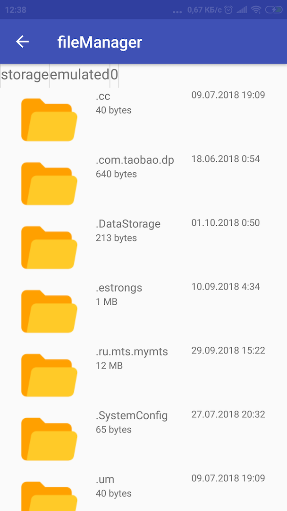
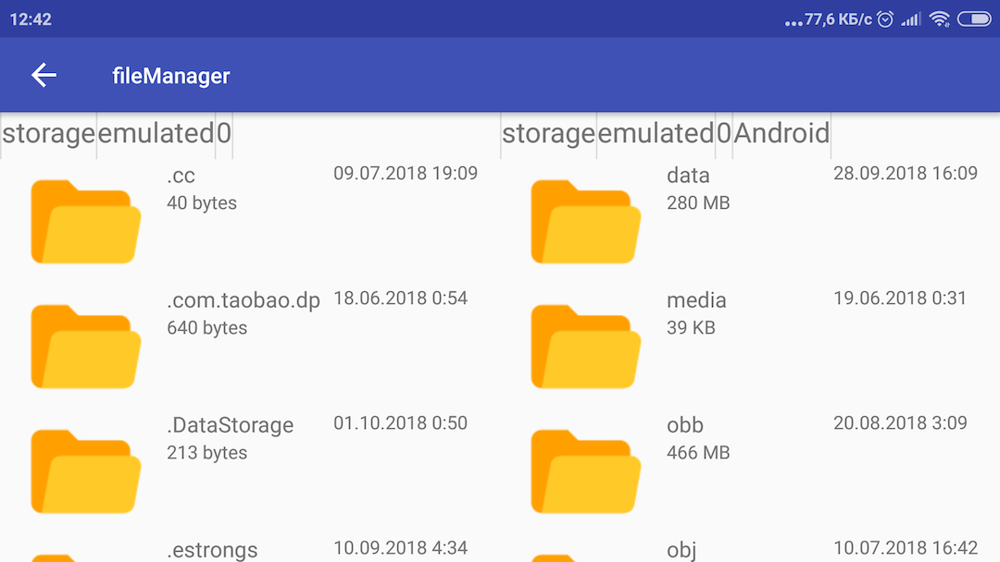

# Filemanager
It project based on the MVC architecture.
This is a simple application that allows you to browse files 
in a directory, open them. It also quickly calculates the sizes of folders
and files in asynchronous mode and has two windows for working with files. 

This is used JDBC for caching sizes of folders, ViewPager for two Windows and RecyclerView for list of folder and files.
